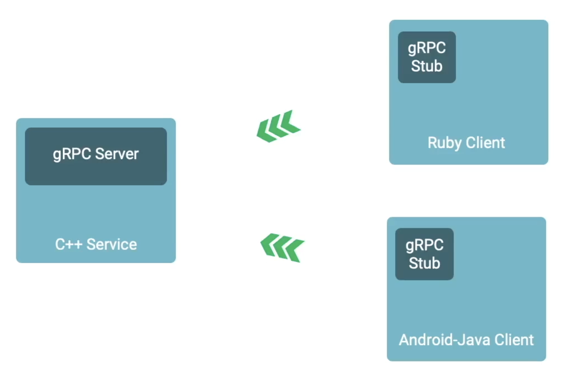
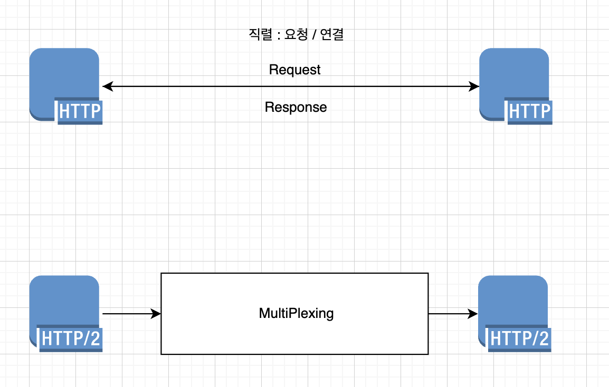

# GRPC



## Theory

### Protocol Buffer

- RESTFulAPI의 Request/Response의 Data 직렬화 모델 같은 것
- JSON과 유사하다고 생각하면 편할 듯

```json
## RestFulAPI Reqest / Response

POST /user
{
    "name" : "leedonggyu",
    "email" : "zkfmapf999@gmail.com"
}

## Protobuf 

syntax = "proto3";

message User {
    int32 id = 1;
    string name = 2;
    string email = 3;
}

service UserService {
    rpc CreateUser(User) returns (User);
}
```

- 장점
    - Less CPU Intensive
    - Faster 
    - MicroService에 적합함 (통신규약)

- HTTP1 동작원리
    - TCP/IP + 3 Way Handshake
    - 직렬로 연결을 요청
    - 각 요청바다 헤더 정보가 반복되어 -> 데이터 오버헤드가 발생
    - 하나의 요청이 완료될때까지 -> 다른 요청이 대기

- HTTP2 동작원리
    - TCP/IP + 3 Way Handshake
    - 단일 TCP 연결에서 여러 요청과 응답을 처리 -> MultiPlexing
    - Header자체를 압축 (HPACK 압축) -> 데이터 오버헤드가 줄어듬
    - 서버가 클라이언트 요청을 기다리지 않고 -> 리소스 푸시 가능
    - 스트림 우선 순위 가능 -> 요청/응답의 우선순위를 지정 -> 중요한 데이터가 먼저 전송되도록 가능

    

## Benchmark

- Required

- RESTful API

- GRPC

- EventDriven (EventBridge + SQS)


## Reference

- <a href="https://imagekit.io/demo/http2-vs-http1?utm_source=blog&utm_medium=blog&utm_campaign=Blog"> HTTP1 vs HTTP2 </a>